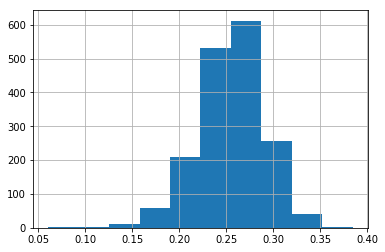

# SabermetricsFinalProject

Visit http://157.230.226.56/ to access the site!

You have to decompress the data.zip file to get csv files needed in the jupyter notebook

# Correlation to other statistics
| Statistic name | Correlation with IABA | P-val |
|---|---|---|
| BA | 0.7298994411504203 | 1.0874030770893327e-240 |
| OBP | 0.46673904191644827 | 4.5996568389469993e-79 |
| OPS | 0.4472021248079238 | 5.675155491600669e-72 |
| Team Wins | 0.11882304538122929 | 0.1961488642999242 |
| Baseball Reference War | 0.34727003401060763 | 4.279123724009032e-50 |

# Results

  <h5 align="center">IABA<h5>
  

  <h5 align="center">BA<h5>
  

