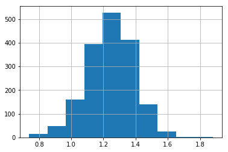

# IABA: Inning Adjusted Batting Average

Visit http://157.230.226.56/ to access the site!

You have to decompress the data.zip file to get csv files needed in the jupyter notebook

# Description
There are many batting statistics in baseball that can help managers and team owners to predict and help them made decisions during a season. However, baseball is a really complex game and the current statistics do not cover all aspects of the game. Having this in mind, we decided to work on a statistic that could help managers to make decisions during close games. Many games during the season go to extra innings which cause the use of many pitchers for a game. This affect the extra inning game and also the game in the next day because many of the pitchers will be tired and not available to pitch the next day. Based on the article Exploring extra innings by Devan Fink, extra inning games make up anywhere from 7.6 percent to 10 percent of total games played in an entire season. To solve the extra innings problem, managers should be able to pick players that will help the team to win the game in regular innings or playing the less amount of extra innings. We decided to create a statistic that adjusted the batting average based on the inning when a player got a hit, so that a player who can get hits later in the game will have a higher score than a player with hits at the beginning of the game. The formula that we used is:

  <ins>1*H1+2*H2+3*H3+...+9*H9</ins> 
  AB(1st-9th inning)

With this statistic, managers could see which players have a better performance late in the game which could help the team win close games. For example, if a team is tied in the 9th inning, the manager could use the IABA statistic to find a pinch hitter that would have a higher probability to get a hit to get on base or bat a run in. Other statistic like batting average or on-base percentage show players that can get hits or walks, but they do not show when in the game they get them. A player might have a high batting average, but he might get most of his hits early in the game, which means that he might not be as effective if he is trying to get a hit late in the game.
 
# Correlation to other statistics
| Statistic name | Correlation with IABA | P-val |
|---|---|---|
| BA | 0.7298994411504203 | 1.0874030770893327e-240 |
| OBP | 0.46673904191644827 | 4.5996568389469993e-79 |
| OPS | 0.4472021248079238 | 5.675155491600669e-72 |
| Team Wins | 0.11882304538122929 | 0.1961488642999242 |
| Baseball Reference War | 0.34727003401060763 | 4.279123724009032e-50 |

# Results

  <h5 align="center"> IABA </h5>

  

  <h5 align="center"> BA </h5>

  

